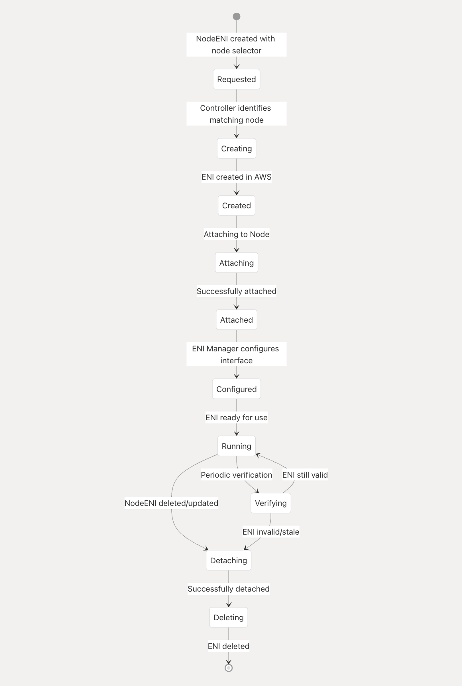

# AWS Multi-ENI Controller for Kubernetes

[](https://opensource.org/licenses/Apache-2.0)
[](https://github.com/johnlam90/aws-multi-eni-controller/actions/workflows/go-report.yml)
[](https://go.dev/)
[](https://helm.sh)
[](https://github.com/johnlam90/aws-multi-eni-controller/releases)

A Kubernetes controller that automatically creates and attaches AWS Elastic Network Interfaces (ENIs) to nodes based on node labels. This controller is useful for workloads that require multiple network interfaces, such as networking plugins, security tools, or specialized applications.

## Overview

The AWS Multi-ENI Controller consists of two main components:

1. **NodeENI Controller**: Watches for NodeENI custom resources and nodes with matching labels. When a node matches the selector in a NodeENI resource, the controller creates an ENI in the specified subnet with the specified security groups and attaches it to the node at the specified device index.

2. **ENI Manager**: A DaemonSet that runs on nodes with matching labels and automatically brings up secondary interfaces when they're attached.

When a node no longer matches the selector or when the NodeENI resource is deleted, the controller automatically detaches and deletes the ENI, ensuring proper cleanup of AWS resources.

## Features

- **Dynamic ENI Management**: Automatically creates and attaches ENIs to nodes based on labels
- **Multi-Subnet Support**: Can attach ENIs from different subnets to the same or different nodes
- **Subnet Flexibility**: Supports both subnet IDs and subnet names (via AWS tags)
- **Security Group Flexibility**: Supports both security group IDs and names
- **MTU Configuration**: Configure custom MTU settings for ENIs (e.g., jumbo frames)
- **Proper Cleanup**: Uses finalizers to ensure ENIs are properly detached and deleted when no longer needed
- **Parallel ENI Cleanup**: Efficiently cleans up multiple ENIs in parallel for improved performance
- **Configurable Concurrency**: Control the number of concurrent operations for better scaling
- **Cross-Distribution Compatibility**: Works across all Linux distributions with different interface naming patterns
- **AWS SDK v2 Integration**: Uses the latest AWS SDK Go v2 for improved performance and features
- **Optimized Image**: Lightweight container image (22MB) for fast deployments
- **Helm Support**: Easy deployment with Helm charts and OCI registry

## Quick Start

### Prerequisites

- Kubernetes cluster running on AWS (e.g., EKS)
- kubectl configured to access your cluster
- Helm 3.0+ (for Helm installation)
- IAM permissions for EC2 ENI operations

### Install with Helm (Recommended)

```bash
# Install the latest version
helm install aws-multi-eni oci://ghcr.io/johnlam90/charts/aws-multi-eni-controller --version 1.2.7

# With custom values
helm install aws-multi-eni oci://ghcr.io/johnlam90/charts/aws-multi-eni-controller --version 1.2.7 \
  --set awsRegion=us-east-1 \
  --set nodeSelector.ng=multi-eni
```

### Create a NodeENI Resource

```yaml
apiVersion: networking.k8s.aws/v1alpha1
kind: NodeENI
metadata:
  name: multus-eni-config
spec:
  nodeSelector:
    ng: multi-eni
  subnetID: subnet-0f59b4f14737be9ad  # Use your subnet ID
  securityGroupIDs:
  - sg-05da196f3314d4af8  # Use your security group ID
  deviceIndex: 2
  mtu: 9001  # Optional: Set MTU for jumbo frames
  deleteOnTermination: true
  description: "Multus ENI for secondary network interfaces"
```

### Label Your Nodes

```bash
kubectl label node your-node-name ng=multi-eni
```

### Verify ENI Creation

```bash
kubectl get nodeeni multus-eni-config -o yaml
```

## Configuration Options

### Using Subnet Names Instead of IDs

```yaml
apiVersion: networking.k8s.aws/v1alpha1
kind: NodeENI
metadata:
  name: multus-eni-subnet-name
spec:
  nodeSelector:
    ng: multi-eni
  subnetName: my-subnet-name  # Subnet with this Name tag will be used
  securityGroupIDs:
  - sg-05da196f3314d4af8
  deviceIndex: 2
```

### Using Security Group Names Instead of IDs

```yaml
apiVersion: networking.k8s.aws/v1alpha1
kind: NodeENI
metadata:
  name: multus-eni-sg-name
spec:
  nodeSelector:
    ng: multi-eni
  subnetID: subnet-0f59b4f14737be9ad
  securityGroupNames:
  - my-security-group  # Security group with this name will be used
  deviceIndex: 2
```

### Multiple Subnets Configuration

```yaml
apiVersion: networking.k8s.aws/v1alpha1
kind: NodeENI
metadata:
  name: multi-subnet-nodeeni
spec:
  nodeSelector:
    ng: multi-eni
  subnetNames:
  - multus-test-subnet-1
  - multus-test-subnet-2
  securityGroupNames:
  - multus-test-sg
  deviceIndex: 2
  mtu: 9001
  deleteOnTermination: true
```

### MTU Configuration

The controller supports configuring custom MTU values for ENIs, which is useful for enabling jumbo frames (9001 bytes) or other specialized network configurations:

```yaml
apiVersion: networking.k8s.aws/v1alpha1
kind: NodeENI
metadata:
  name: jumbo-frames-eni
spec:
  nodeSelector:
    ng: multi-eni
  subnetID: subnet-0f59b4f14737be9ad
  securityGroupIDs:
  - sg-05da196f3314d4af8
  deviceIndex: 2
  mtu: 9001  # Set MTU to 9001 for jumbo frames
```

## Scaling and Performance

The controller includes configuration options to optimize performance in larger deployments:

### Controller Concurrency

Control how many NodeENI resources can be reconciled in parallel:

```yaml
# In Helm values.yaml
controller:
  maxConcurrentReconciles: 10  # Default: 5
```

### ENI Cleanup Concurrency

Control how many ENIs can be cleaned up in parallel:

```yaml
# In Helm values.yaml
controller:
  maxConcurrentENICleanup: 5  # Default: 3
```

## Troubleshooting

### Common Issues

1. **ENI not being created**:
   - Check controller logs: `kubectl logs -n eni-controller-system deployment/eni-controller`
   - Verify node labels: `kubectl get nodes --show-labels | grep multi-eni`
   - Check AWS permissions for ENI creation

2. **ENI not being deleted**:
   - Check finalizers on NodeENI: `kubectl get nodeeni -o yaml`
   - Verify AWS permissions for ENI deletion

3. **Interface not coming up**:
   - Check ENI Manager logs: `kubectl logs -n eni-controller-system daemonset/eni-manager`
   - Verify ENI Manager is running on the node

4. **MTU not being applied**:
   - Ensure MTU is set in the NodeENI resource
   - Check ENI Manager logs for MTU configuration issues

## Documentation

- [Architecture](docs/architecture.md) - Detailed architecture and workflow
- [Deployment](docs/deployment.md) - Comprehensive deployment options
- [Configuration](docs/configuration.md) - Advanced configuration options
- [Troubleshooting](docs/troubleshooting.md) - Detailed troubleshooting guide

## Architecture

The AWS Multi-ENI Controller follows the Kubernetes operator pattern with two main components:

1. **NodeENI Controller**: Manages the lifecycle of ENIs based on NodeENI resources
2. **ENI Manager**: Brings up secondary interfaces on nodes

### ENI Lifecycle

The following diagram illustrates the complete lifecycle of an ENI managed by the controller:



The diagram shows the flow from NodeENI creation through ENI creation, attachment, configuration, and eventual cleanup when the NodeENI is deleted or updated.

For a code-based version of this diagram (using Mermaid.js), see [ENI Lifecycle Diagram](docs/diagrams/eni-lifecycle.md).

### Component Architecture

The AWS Multi-ENI Controller consists of several components working together. To see a visual representation of the system architecture, check out the [Architecture Diagram](docs/diagrams/architecture-diagram.md).

To understand the detailed relationships between the key components of the AWS Multi-ENI Controller, see the [Class Diagram](docs/diagrams/class-diagram.md).

## Contributing

Contributions are welcome! Please see [CONTRIBUTING.md](CONTRIBUTING.md) for details.

## License

This project is licensed under the Apache License 2.0 - see the [LICENSE](LICENSE) file for details.
