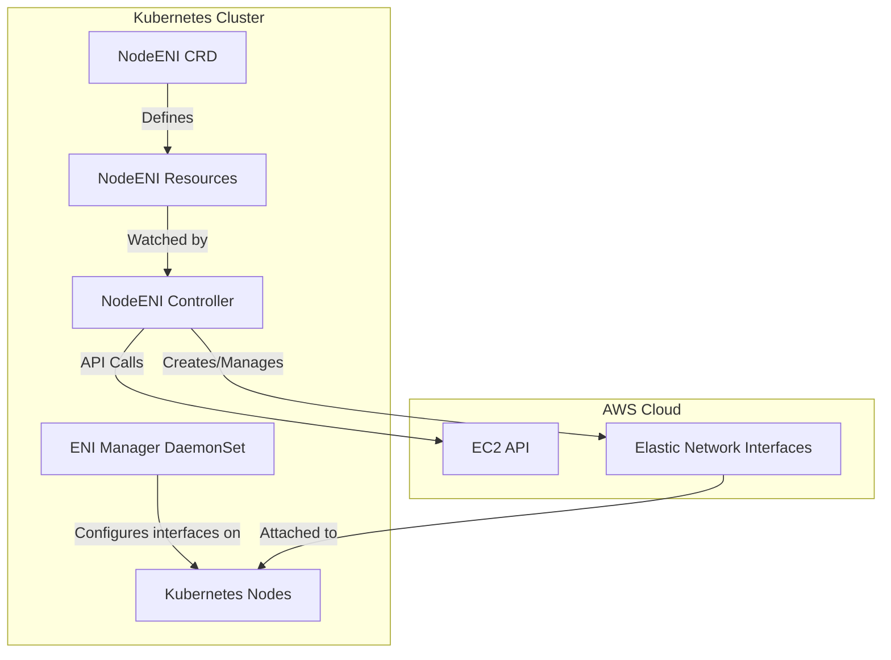
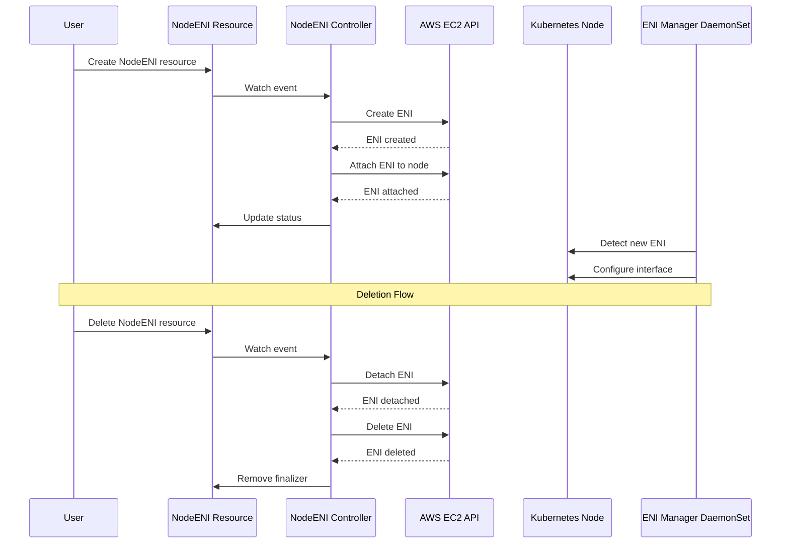
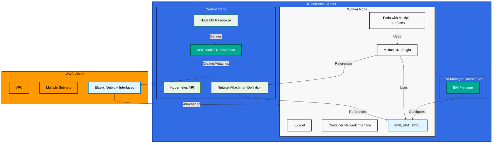
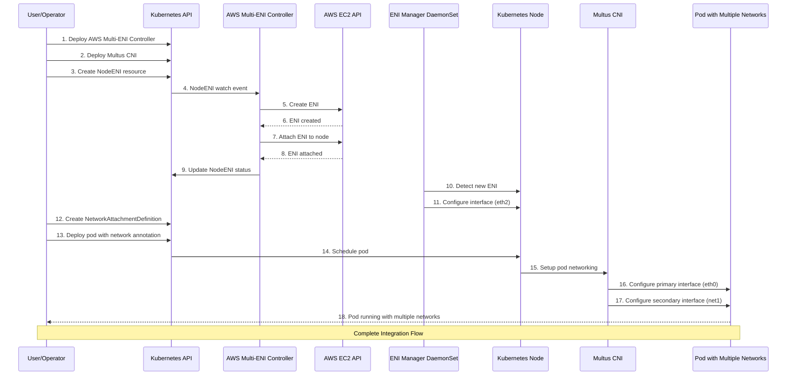

# AWS Multi-ENI Controller for Kubernetes

[](https://opensource.org/licenses/Apache-2.0)
[](https://github.com/johnlam90/aws-multi-eni-controller/actions/workflows/go-report.yml)
[](https://go.dev/)
[](https://helm.sh)
[](https://github.com/johnlam90/aws-multi-eni-controller/releases)
[](https://johnlam90.github.io/aws-multi-eni-controller/)
[](https://www.bestpractices.dev/)

## Overview

The AWS Multi-ENI Controller is a Kubernetes controller **purpose-built for Multus CNI deployments on AWS**. It automatically creates and attaches AWS Elastic Network Interfaces (ENIs) to nodes based on node labels, enabling Multus CNI to provide multiple network interfaces to pods without complex infrastructure templates.

By bridging the gap between AWS networking and Kubernetes multi-network capabilities, this controller solves the challenge of dynamically provisioning and managing ENIs for Multus CNI. It follows the Kubernetes operator pattern and provides a declarative way to manage ENIs through custom resources, making it ideal for workloads that require multiple network interfaces, such as networking plugins, security tools, or specialized applications.

## Architecture

The AWS Multi-ENI Controller consists of two main components:

1. **NodeENI Controller**: Watches for NodeENI custom resources and nodes with matching labels. When a node matches the selector in a NodeENI resource, the controller creates an ENI in the specified subnet with the specified security groups and attaches it to the node at the specified device index.

2. **ENI Manager**: A DaemonSet that runs on nodes with matching labels and automatically brings up secondary interfaces when they're attached.It can also set mtu,bind dpdk interfaces and advertise sriov dpdk resources to the ec2 worker node.

### System Architecture Diagram

The following diagram illustrates the overall architecture and interaction between components:


This diagram shows how the AWS Multi-ENI Controller integrates with Kubernetes and AWS to provide multiple network interfaces for pods using Multus CNI.



### ENI Lifecycle



## Prerequisites

Before deploying the AWS Multi-ENI Controller, ensure you have:

- Kubernetes cluster running on AWS (e.g., EKS)
- kubectl configured to access your cluster
- Helm 3.0+ (for Helm installation)
- IAM permissions for EC2 ENI operations

### Required IAM Permissions

The controller requires the following IAM permissions:

```json
{
  "Version": "2012-10-17",
  "Statement": [
    {
      "Effect": "Allow",
      "Action": [
        "ec2:CreateNetworkInterface",
        "ec2:DeleteNetworkInterface",
        "ec2:DetachNetworkInterface",
        "ec2:AttachNetworkInterface",
        "ec2:DescribeInstances",
        "ec2:DescribeNetworkInterfaces",
        "ec2:DescribeSubnets",
        "ec2:DescribeSecurityGroups",
        "ec2:ModifyNetworkInterfaceAttribute"
      ],
      "Resource": "*"
    }
  ]
}
```

## Installation

### Option 1: Install with Helm (Recommended)

```bash
# Install the latest version
helm install aws-multi-eni oci://ghcr.io/johnlam90/charts/aws-multi-eni-controller --version 1.3.5 \
  --namespace eni-controller-system --create-namespace

# With custom values
helm install aws-multi-eni oci://ghcr.io/johnlam90/charts/aws-multi-eni-controller --version 1.3.5 \
  --namespace eni-controller-system --create-namespace \
  --set awsRegion=us-east-1 \
  --set nodeSelector.ng=multi-eni
```

> **Important**: Always specify the `--namespace eni-controller-system` flag and the `--create-namespace` flag when installing the chart to ensure all resources are created in the correct namespace.

### Option 2: Install with YAML Manifests

```bash
# Clone the repository
git clone https://github.com/johnlam90/aws-multi-eni-controller.git
cd aws-multi-eni-controller

# Apply the CRDs
kubectl apply -f deploy/crds/networking.k8s.aws_nodeenis.yaml

# Apply the controller manifests
kubectl apply -f deploy/controller.yaml
kubectl apply -f deploy/eni-manager.yaml
```

## Usage Examples

### Basic NodeENI Resource

```yaml
apiVersion: networking.k8s.aws/v1alpha1
kind: NodeENI
metadata:
  name: multus-eni-config
spec:
  nodeSelector:
    ng: multi-eni
  subnetID: subnet-0f59b4f14737be9ad  # Use your subnet ID
  securityGroupIDs:
  - sg-05da196f3314d4af8  # Use your security group ID
  deviceIndex: 2
  mtu: 9001  # Optional: Set MTU for jumbo frames
  deleteOnTermination: true
  description: "Multus ENI for secondary network interfaces"
```

### Label Your Nodes

```bash
kubectl label node your-node-name ng=multi-eni
```

### Verify ENI Creation

```bash
kubectl get nodeeni multus-eni-config -o yaml
```

### Using Subnet Names Instead of IDs

```yaml
apiVersion: networking.k8s.aws/v1alpha1
kind: NodeENI
metadata:
  name: multus-eni-subnet-name
spec:
  nodeSelector:
    ng: multi-eni
  subnetName: my-subnet-name  # Subnet with this Name tag will be used
  securityGroupIDs:
  - sg-05da196f3314d4af8
  deviceIndex: 2
```

### Multiple Subnets Configuration

```yaml
apiVersion: networking.k8s.aws/v1alpha1
kind: NodeENI
metadata:
  name: multi-subnet-nodeeni
spec:
  nodeSelector:
    ng: multi-eni
  subnetNames:
  - multus-test-subnet-1
  - multus-test-subnet-2
  securityGroupNames:
  - multus-test-sg
  deviceIndex: 2
  mtu: 9001
  deleteOnTermination: true
```

## Configuration Options

### MTU Configuration

The controller supports configuring custom MTU values for ENIs, which is useful for enabling jumbo frames (9001 bytes) or other specialized network configurations:

```yaml
apiVersion: networking.k8s.aws/v1alpha1
kind: NodeENI
metadata:
  name: jumbo-frames-eni
spec:
  nodeSelector:
    ng: multi-eni
  subnetID: subnet-0f59b4f14737be9ad
  securityGroupIDs:
  - sg-05da196f3314d4af8
  deviceIndex: 2
  mtu: 9001  # Set MTU to 9001 for jumbo frames
```

### DPDK Integration

For high-performance networking applications, the controller supports binding interfaces to DPDK drivers:

```yaml
apiVersion: networking.k8s.aws/v1alpha1
kind: NodeENI
metadata:
  name: dpdk-enabled-eni
spec:
  nodeSelector:
    ng: multi-eni
  subnetID: subnet-0f59b4f14737be9ad
  securityGroupIDs:
  - sg-05da196f3314d4af8
  deviceIndex: 2
  dpdkEnabled: true  # Enable DPDK binding
```

### Controller Concurrency

Control how many NodeENI resources can be reconciled in parallel:

```yaml
# In Helm values.yaml
controller:
  maxConcurrentReconciles: 10  # Default: 5
  maxConcurrentENICleanup: 5   # Default: 3
```

## Multus CNI Integration

The AWS Multi-ENI Controller was **specifically designed** to solve the challenges of using [Multus CNI](https://github.com/k8snetworkplumbingwg/multus-cni) in AWS environments. This section provides comprehensive guidance on integrating these two technologies.

### Understanding Multus CNI and AWS Multi-ENI Controller

### How They Work Together



1. **AWS Multi-ENI Controller** watches for NodeENI resources and creates/attaches ENIs to nodes
2. **ENI Manager DaemonSet** configures the network interfaces on the nodes
3. **Multus CNI** uses these interfaces to provide additional networks to pods
4. **NetworkAttachmentDefinition** resources define how pods connect to these additional networks

### Deployment Sequence

1. Deploy the AWS Multi-ENI Controller
2. Create NodeENI resources to provision ENIs on nodes
3. Deploy Multus CNI
4. Create NetworkAttachmentDefinition resources referencing the ENIs
5. Deploy pods that use the additional networks

## Example Configurations

### 1. Basic Multus Integration

First, create a NodeENI resource to provision an ENI:

```yaml
apiVersion: networking.k8s.aws/v1alpha1
kind: NodeENI
metadata:
  name: multus-eni-config
spec:
  nodeSelector:
    ng: multi-eni
  subnetID: subnet-0f59b4f14737be9ad
  securityGroupIDs:
  - sg-05da196f3314d4af8
  deviceIndex: 2  # This will create eth2 on the node
  mtu: 9001
  deleteOnTermination: true
  description: "Multus ENI for secondary network interfaces"
```

Then, create a NetworkAttachmentDefinition that uses this interface:

```yaml
apiVersion: k8s.cni.cncf.io/v1
kind: NetworkAttachmentDefinition
metadata:
  name: secondary-network
spec:
  config: '{
    "cniVersion": "0.3.1",
    "type": "ipvlan",
    "master": "eth2",
    "mode": "l2",
    "ipam": {
      "type": "host-local",
      "subnet": "192.168.1.0/24",
      "rangeStart": "192.168.1.200",
      "rangeEnd": "192.168.1.250"
    }
  }'
```

Finally, deploy pods that use this network:

```yaml
apiVersion: v1
kind: Pod
metadata:
  name: multinet-pod
  annotations:
    k8s.v1.cni.cncf.io/networks: secondary-network
spec:
  containers:
  - name: multinet-container
    image: nginx
    resources:
      requests:
        cpu: 100m
        memory: 128Mi
```

### 2. Multi-Subnet Configuration

For applications that need to connect to multiple subnets:

```yaml
# First, create NodeENI resources for different subnets
apiVersion: networking.k8s.aws/v1alpha1
kind: NodeENI
metadata:
  name: multus-eni-subnet1
spec:
  nodeSelector:
    ng: multi-eni
  subnetID: subnet-0f59b4f14737be9ad  # First subnet
  securityGroupIDs:
  - sg-05da196f3314d4af8
  deviceIndex: 2  # This will create eth2
  mtu: 9001
---
apiVersion: networking.k8s.aws/v1alpha1
kind: NodeENI
metadata:
  name: multus-eni-subnet2
spec:
  nodeSelector:
    ng: multi-eni
  subnetID: subnet-abcdef1234567890  # Second subnet
  securityGroupIDs:
  - sg-05da196f3314d4af8
  deviceIndex: 3  # This will create eth3
  mtu: 9001
```

Then create NetworkAttachmentDefinitions for each subnet:

```yaml
apiVersion: k8s.cni.cncf.io/v1
kind: NetworkAttachmentDefinition
metadata:
  name: subnet1-network
spec:
  config: '{
    "cniVersion": "0.3.1",
    "type": "ipvlan",
    "master": "eth2",
    "mode": "l2",
    "ipam": {
      "type": "host-local",
      "subnet": "10.1.0.0/24",
      "rangeStart": "10.1.0.100",
      "rangeEnd": "10.1.0.200"
    }
  }'
---
apiVersion: k8s.cni.cncf.io/v1
kind: NetworkAttachmentDefinition
metadata:
  name: subnet2-network
spec:
  config: '{
    "cniVersion": "0.3.1",
    "type": "ipvlan",
    "master": "eth3",
    "mode": "l2",
    "ipam": {
      "type": "host-local",
      "subnet": "10.2.0.0/24",
      "rangeStart": "10.2.0.100",
      "rangeEnd": "10.2.0.200"
    }
  }'
```

Deploy a pod that connects to both networks:

```yaml
apiVersion: v1
kind: Pod
metadata:
  name: multi-subnet-pod
  annotations:
    k8s.v1.cni.cncf.io/networks: subnet1-network,subnet2-network
spec:
  containers:
  - name: multi-subnet-container
    image: nginx
```

### 3. DPDK Integration with Multus

For high-performance networking applications:

```yaml
# Create a NodeENI with DPDK enabled
apiVersion: networking.k8s.aws/v1alpha1
kind: NodeENI
metadata:
  name: dpdk-eni
spec:
  nodeSelector:
    ng: multi-eni
  subnetID: subnet-0f59b4f14737be9ad
  securityGroupIDs:
  - sg-05da196f3314d4af8
  deviceIndex: 2
  dpdkEnabled: true
  dpdkDriver: "vfio-pci"
  dpdkResourceName: "intel.com/intel_sriov_netdevice"
```

Create a NetworkAttachmentDefinition for DPDK:

```yaml
apiVersion: k8s.cni.cncf.io/v1
kind: NetworkAttachmentDefinition
metadata:
  name: dpdk-network
spec:
  config: '{
    "cniVersion": "0.3.1",
    "type": "host-device",
    "device": "0000:00:06.0",
    "vlan": 1000,
    "ipam": {
      "type": "host-local",
      "subnet": "192.168.1.0/24",
      "rangeStart": "192.168.1.200",
      "rangeEnd": "192.168.1.250"
    }
  }'
```

Deploy a pod that uses DPDK:

```yaml
apiVersion: v1
kind: Pod
metadata:
  name: dpdk-pod
  annotations:
    k8s.v1.cni.cncf.io/networks: dpdk-network
spec:
  containers:
  - name: dpdk-container
    image: dpdk-app:latest
    resources:
      limits:
        intel.com/intel_sriov_netdevice: 1
```

### 4. Real-World Use Cases

#### Network Isolation for Multi-Tenant Applications

```yaml
# Create NodeENI resources for tenant-specific subnets
apiVersion: networking.k8s.aws/v1alpha1
kind: NodeENI
metadata:
  name: tenant-a-eni
spec:
  nodeSelector:
    ng: multi-tenant
  subnetID: subnet-tenant-a
  securityGroupIDs:
  - sg-tenant-a
  deviceIndex: 2
---
apiVersion: networking.k8s.aws/v1alpha1
kind: NodeENI
metadata:
  name: tenant-b-eni
spec:
  nodeSelector:
    ng: multi-tenant
  subnetID: subnet-tenant-b
  securityGroupIDs:
  - sg-tenant-b
  deviceIndex: 3
```

Create NetworkAttachmentDefinitions for each tenant:

```yaml
apiVersion: k8s.cni.cncf.io/v1
kind: NetworkAttachmentDefinition
metadata:
  name: tenant-a-network
  namespace: tenant-a
spec:
  config: '{
    "cniVersion": "0.3.1",
    "type": "ipvlan",
    "master": "eth2",
    "mode": "l2",
    "ipam": {
      "type": "host-local",
      "subnet": "10.10.0.0/24"
    }
  }'
---
apiVersion: k8s.cni.cncf.io/v1
kind: NetworkAttachmentDefinition
metadata:
  name: tenant-b-network
  namespace: tenant-b
spec:
  config: '{
    "cniVersion": "0.3.1",
    "type": "ipvlan",
    "master": "eth3",
    "mode": "l2",
    "ipam": {
      "type": "host-local",
      "subnet": "10.20.0.0/24"
    }
  }'
```

#### Network Security Appliances

For deploying network security appliances that need to inspect traffic:

```yaml
apiVersion: v1
kind: Pod
metadata:
  name: network-firewall
  annotations:
    k8s.v1.cni.cncf.io/networks: ingress-network,egress-network
spec:
  containers:
  - name: firewall
    image: network-firewall:latest
    securityContext:
      capabilities:
        add: ["NET_ADMIN"]
```

### 5. Best Practices for Multus CNI with AWS Multi-ENI Controller

#### Device Index Management

Maintain consistent device indices across your cluster:

```yaml
# Standard device index allocation
# eth0: Primary ENI (managed by AWS)
# eth1: Reserved for AWS CNI (if using)
# eth2: First Multus network
# eth3: Second Multus network
# eth4: Third Multus network
```

#### Network Attachment Definition Naming Conventions

Use a consistent naming convention for NetworkAttachmentDefinitions:

```yaml
apiVersion: k8s.cni.cncf.io/v1
kind: NetworkAttachmentDefinition
metadata:
  # Format: <purpose>-<subnet>-<index>
  name: app-subnet1-eth2
spec:
  config: '{ ... }'
```

#### Resource Requests for Multi-Network Pods

Always specify resource requests for pods with multiple networks:

```yaml
apiVersion: v1
kind: Pod
metadata:
  name: multi-net-pod
  annotations:
    k8s.v1.cni.cncf.io/networks: network1,network2
spec:
  containers:
  - name: app
    image: app:latest
    resources:
      requests:
        cpu: 200m
        memory: 256Mi
      limits:
        cpu: 500m
        memory: 512Mi
```

#### Monitoring ENI Attachments

Create a monitoring solution to track ENI attachments:

```bash
# Example script to monitor ENI status
kubectl get nodeeni -o custom-columns=NAME:.metadata.name,NODES:.status.attachments[*].nodeID,ENIs:.status.attachments[*].eniID,STATUS:.status.attachments[*].status
```

## Troubleshooting

### Common Issues with AWS Multi-ENI Controller

1. **ENI not being created**:
   - Check controller logs: `kubectl logs -n eni-controller-system deployment/eni-controller`
   - Verify node labels: `kubectl get nodes --show-labels | grep multi-eni`
   - Check AWS permissions for ENI creation

2. **ENI not being deleted**:
   - Check finalizers on NodeENI: `kubectl get nodeeni -o yaml`
   - Verify AWS permissions for ENI deletion

3. **Interface not coming up**:
   - Check ENI Manager logs: `kubectl logs -n eni-controller-system daemonset/eni-manager`
   - Verify ENI Manager is running on the node

4. **MTU not being applied**:
   - Ensure MTU is set in the NodeENI resource
   - Check ENI Manager logs for MTU configuration issues

### Multus CNI Integration Issues

1. **Pods can't access secondary networks**:
   - Verify the NetworkAttachmentDefinition references the correct interface name
   - Check Multus logs: `kubectl logs -n kube-system daemonset/kube-multus-ds`
   - Verify the interface is up on the node: `ip link show eth2`
   - Check pod annotations are correct: `kubectl get pod <pod-name> -o yaml | grep annotations -A5`

2. **Wrong IP assignment on secondary networks**:
   - Check IPAM configuration in the NetworkAttachmentDefinition
   - Verify subnet configuration matches the actual ENI subnet
   - Check for IP conflicts with other pods

3. **DPDK binding issues**:
   - Verify DPDK kernel modules are loaded: `lsmod | grep vfio`
   - Check SRIOV device plugin is running: `kubectl get pods -n kube-system | grep sriov`
   - Verify PCI address is correct: `ls -l /sys/bus/pci/devices/`

4. **Multus CNI and AWS Multi-ENI Controller version compatibility**:
   - Ensure Multus CNI version is compatible (v3.7+ recommended)
   - Check for any warnings in Multus logs about interface detection

### Debugging Commands

```bash
# Check NodeENI status
kubectl get nodeeni -o wide

# Check NetworkAttachmentDefinition
kubectl get net-attach-def -A

# Check Multus logs
kubectl logs -n kube-system daemonset/kube-multus-ds

# Check ENI Manager logs
kubectl logs -n eni-controller-system daemonset/eni-manager

# Check interfaces on a node
kubectl debug node/<node-name> -it --image=busybox -- ip addr

# Check pod network interfaces
kubectl exec -it <pod-name> -- ip addr

# Verify DPDK binding status
kubectl exec -it <pod-name> -- dpdk-devbind.py --status
```

### Common Error Messages and Solutions

| Error Message | Possible Cause | Solution |
|---------------|----------------|----------|
| `failed to find plugin "ipvlan" in path` | Multus CNI plugin not installed correctly | Verify Multus CNI installation and CNI plugins |
| `error getting interface "eth2": no such network interface` | ENI not attached or interface not up | Check ENI Manager logs and node interface status |
| `failed to allocate for range 0: no IP addresses available in range set` | IPAM exhausted or misconfigured | Adjust IPAM range or check for leaked IPs |
| `cannot allocate resource intel.com/intel_sriov_netdevice` | SRIOV device plugin issue or resource exhausted | Check SRIOV device plugin status and resource allocation |

## Complete Multus CNI Integration Workflow

The following diagram illustrates the complete workflow of AWS Multi-ENI Controller with Multus CNI:



### End-to-End Integration Steps

1. **Deploy AWS Multi-ENI Controller**: Install the controller in your cluster
2. **Deploy Multus CNI**: Install Multus CNI in your cluster
3. **Create NodeENI Resources**: Define which nodes should get ENIs and from which subnets
4. **Controller Creates/Attaches ENIs**: The controller automatically creates and attaches ENIs to nodes
5. **ENI Manager Configures Interfaces**: The ENI Manager brings up the interfaces on the nodes
6. **Create NetworkAttachmentDefinitions**: Define how pods should use these interfaces
7. **Deploy Pods with Network Annotations**: Specify which additional networks pods should use
8. **Multus Configures Pod Networking**: Multus sets up additional interfaces in the pods

## Documentation

For more detailed information, please refer to the following documentation:

- [Architecture](docs/architecture.md) - Detailed architecture and workflow
- [Deployment](docs/deployment.md) - Comprehensive deployment options
- [Configuration](docs/configuration.md) - Advanced configuration options
- [Multus CNI Integration](docs/multus-integration.md) - Detailed guide for Multus CNI integration
- [Troubleshooting](docs/troubleshooting.md) - Detailed troubleshooting guide
- [DPDK Integration](docs/dpdk.md) - DPDK setup and configuration

## Contributing

Contributions are welcome! Please see [CONTRIBUTING.md](CONTRIBUTING.md) for details.

## License

This project is licensed under the Apache License 2.0 - see the [LICENSE](LICENSE) file for details.
