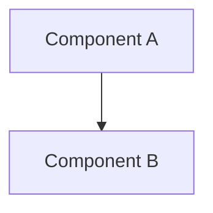

# Architecture Diagrams

This directory contains the architecture diagrams for the AWS Multi-ENI Controller project.

## Files Overview

- `arch.drawio.svg` - Main architecture diagram (Draw.io format, embedded in main README)
- `architecture-diagram.md` - Mermaid-based architecture diagram with documentation
- `class-diagram.md` - Class/component relationship diagrams
- `eni-lifecycle.md` - ENI lifecycle flow diagrams

## Version Control Strategy

### Current Approach (Recommended)

We use a **file-based approach** where diagrams are stored as files in the repository:

```
docs/diagrams/
├── arch.drawio.svg          ← Main architecture diagram (Draw.io)
├── architecture-diagram.md  ← Mermaid version + docs
├── class-diagram.md         ← Component diagrams
└── eni-lifecycle.md         ← Process flow diagrams
```

**Benefits:**
- ✅ Full version history with Git
- ✅ Diff tracking for changes
- ✅ Works offline and in forks
- ✅ GitHub renders SVG natively
- ✅ No external dependencies
- ✅ Collaborative editing via PRs

### Editing Workflows

#### For Draw.io Diagrams (`arch.drawio.svg`)

1. **Online Editing:**
   ```bash
   # Open in Draw.io online editor
   # Go to: https://app.diagrams.net/
   # File → Open from → GitHub (connect your repo)
   # Edit and save back to GitHub
   ```

2. **Local Editing:**
   ```bash
   # Download Draw.io desktop app
   # Open arch.drawio.svg locally
   # Edit and commit changes
   git add docs/diagrams/arch.drawio.svg
   git commit -m "Update architecture diagram"
   ```

3. **VS Code Integration:**
   ```bash
   # Install Draw.io Integration extension
   # Edit .drawio.svg files directly in VS Code
   ```

#### For Mermaid Diagrams

1. **Direct Editing:**
   ```bash
   # Edit the .md files directly
   vim docs/diagrams/architecture-diagram.md
   ```

2. **Live Preview:**
   ```bash
   # Use Mermaid Live Editor: https://mermaid.live/
   # Copy code, edit, then paste back
   ```

### Best Practices

#### 1. Commit Messages
```bash
# Good commit messages for diagrams
git commit -m "docs: update architecture diagram to show new ENI manager flow"
git commit -m "docs: add DPDK integration to architecture diagram"
git commit -m "docs: fix component relationships in class diagram"
```

#### 2. Review Process
- Always create PRs for diagram changes
- Include screenshots in PR descriptions
- Tag relevant team members for review
- Update related documentation

#### 3. Consistency
- Use consistent naming conventions
- Maintain similar styling across diagrams
- Keep diagrams up-to-date with code changes
- Document diagram update procedures

### Alternative Approaches

#### Option 1: Diagram as Code (Current Mermaid approach)
```markdown
<!-- In markdown files -->

```

**Pros:** Easy to diff, version control, collaborative editing
**Cons:** Limited styling options, GitHub-dependent rendering

#### Option 2: External Tool Integration
```yaml
# .github/workflows/diagrams.yml
name: Update Diagrams
on:
  push:
    paths: ['docs/diagrams/sources/**']
jobs:
  generate:
    runs-on: ubuntu-latest
    steps:
      - uses: actions/checkout@v3
      - name: Generate SVG from source
        run: |
          # Convert source files to SVG
          # Commit generated files
```

**Pros:** Automated generation, source separation
**Cons:** Complex setup, CI/CD dependency

#### Option 3: Hybrid Approach (Recommended for your project)
- Keep `arch.drawio.svg` for detailed visual diagrams
- Use Mermaid for simple flow diagrams
- Store both in version control
- Reference from README with relative paths

### Embedding in README

Your current approach is optimal:

```markdown

```

**Why this works well:**
- Relative path keeps everything together
- GitHub renders SVG natively
- Works in forks and offline
- Version controlled with the code
- No external dependencies

### Troubleshooting

#### SVG Not Rendering on GitHub
- Ensure SVG doesn't contain JavaScript
- Check file size (GitHub has limits)
- Verify SVG syntax is valid
- Use relative paths, not absolute

#### Large File Sizes
- Optimize SVG files before committing
- Consider using Git LFS for very large diagrams
- Compress images when possible

#### Collaboration Issues
- Use branching strategy for diagram changes
- Communicate diagram updates in team channels
- Keep diagrams in sync with code changes
- Document who owns which diagrams

## Tools and Resources

### Recommended Tools
- **Draw.io**: Free, web-based, GitHub integration
- **Mermaid**: Text-based, GitHub native rendering
- **Lucidchart**: Professional, good for complex diagrams
- **PlantUML**: Code-based, good for technical diagrams

### Useful Links
- [Draw.io GitHub Integration](https://github.com/jgraph/drawio-github)
- [Mermaid Documentation](https://mermaid-js.github.io/mermaid/)
- [GitHub SVG Rendering](https://docs.github.com/en/repositories/working-with-files/using-files/working-with-non-code-files#rendering-and-diffing-images)
