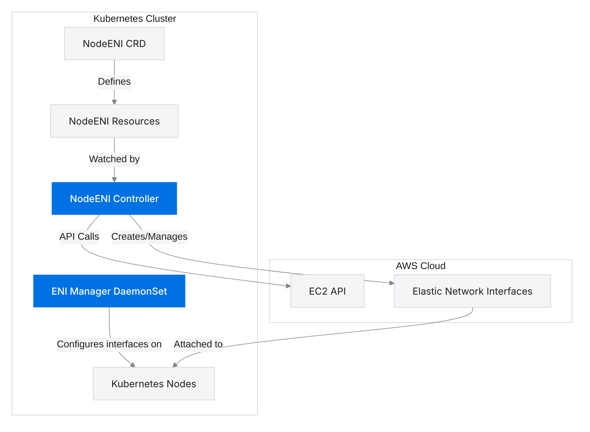

# AWS Multi-ENI Controller Architecture Diagram

This diagram illustrates the high-level architecture and component interactions of the AWS Multi-ENI Controller.

## How to Use This Diagram

This Mermaid.js architecture diagram is directly rendered by GitHub when viewing the markdown file. You can also:

1. Copy the Mermaid code to any Mermaid live editor to modify it
2. Include it in other markdown files by copying the code block
3. Export it as an image using a Mermaid live editor if needed

## Updating the Diagram

To update this diagram:

1. Edit the Mermaid code in this file
2. Commit the changes to the repository
3. GitHub will automatically render the updated diagram

## Diagram Explanation

This architecture diagram shows the main components of the AWS Multi-ENI Controller and how they interact:

1. **NodeENI CRD**: The Custom Resource Definition that defines the NodeENI resource type in Kubernetes
2. **NodeENI Resources**: Instances of the NodeENI custom resource that specify which nodes should get ENIs and how they should be configured
3. **NodeENI Controller**: The main controller that watches NodeENI resources and creates/manages ENIs in AWS
4. **ENI Manager DaemonSet**: Runs on nodes with matching labels and configures the network interfaces
5. **Kubernetes Nodes**: The worker nodes in the Kubernetes cluster that receive the ENIs
6. **EC2 API**: The AWS EC2 API that the controller uses to create, attach, and manage ENIs
7. **Elastic Network Interfaces**: The AWS ENIs that are created and attached to the nodes

The arrows show the flow of information and control between these components:
- The CRD defines the structure of NodeENI resources
- The controller watches NodeENI resources for changes
- The controller makes API calls to the EC2 API
- The controller creates and manages ENIs in AWS
- The ENI Manager DaemonSet configures the network interfaces on the nodes
- The ENIs are attached to the Kubernetes nodes

## Mermaid Resources

- [Mermaid.js Documentation](https://mermaid-js.github.io/mermaid/#/)
- [Mermaid Live Editor](https://mermaid.live/)
