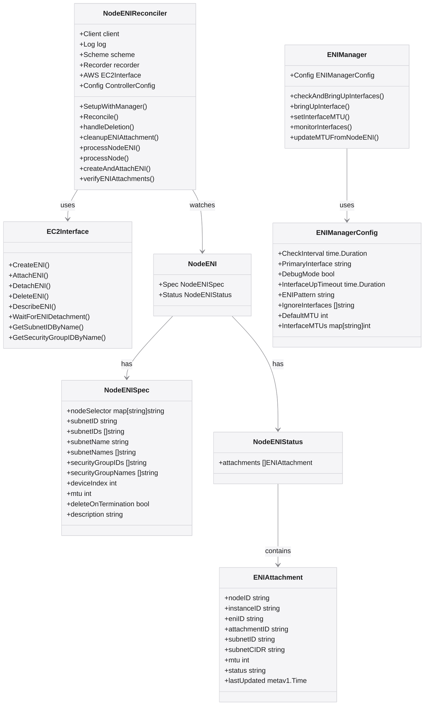

# AWS Multi-ENI Controller Class Diagram

This diagram illustrates the key components and their relationships in the AWS Multi-ENI Controller.

## How to Use This Diagram

This Mermaid.js class diagram is directly rendered by GitHub when viewing the markdown file. You can also:

1. Copy the Mermaid code to any Mermaid live editor to modify it
2. Include it in other markdown files by copying the code block
3. Export it as an image using a Mermaid live editor if needed

## Updating the Diagram

To update this diagram:

1. Edit the Mermaid code in this file
2. Commit the changes to the repository
3. GitHub will automatically render the updated diagram

## Diagram Explanation

This class diagram shows the main components of the AWS Multi-ENI Controller:

1. **NodeENIReconciler**: The main controller that reconciles NodeENI resources
2. **EC2Interface**: Interface for AWS EC2 operations
3. **NodeENI**: Custom resource with Spec and Status
4. **NodeENISpec**: Specification for the NodeENI resource
5. **NodeENIStatus**: Status of the NodeENI resource
6. **ENIAttachment**: Represents an ENI attachment to a node
7. **ENIManager**: DaemonSet component that configures network interfaces
8. **ENIManagerConfig**: Configuration for the ENI Manager

The arrows show the relationships between these components:
- NodeENIReconciler watches NodeENI resources
- NodeENIReconciler uses EC2Interface for AWS operations
- NodeENI has Spec and Status
- NodeENIStatus contains ENIAttachments
- ENIManager uses ENIManagerConfig

## Mermaid Resources

- [Mermaid.js Documentation](https://mermaid-js.github.io/mermaid/#/)
- [Mermaid Live Editor](https://mermaid.live/)
