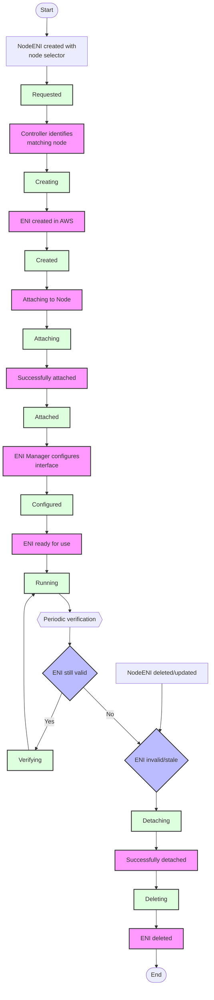

# ENI Lifecycle Diagram

This diagram illustrates the complete lifecycle of an ENI managed by the AWS Multi-ENI Controller.

## How to Use This Diagram

This Mermaid.js diagram is directly rendered by GitHub when viewing the markdown file. You can also:

1. Copy the Mermaid code to any Mermaid live editor to modify it
2. Include it in other markdown files by copying the code block
3. Export it as an image using a Mermaid live editor if needed

## Updating the Diagram

To update this diagram:

1. Edit the Mermaid code in this file
2. Commit the changes to the repository
3. GitHub will automatically render the updated diagram

## Mermaid Resources

- [Mermaid.js Documentation](https://mermaid-js.github.io/mermaid/#/)
- [Mermaid Live Editor](https://mermaid.live/)
