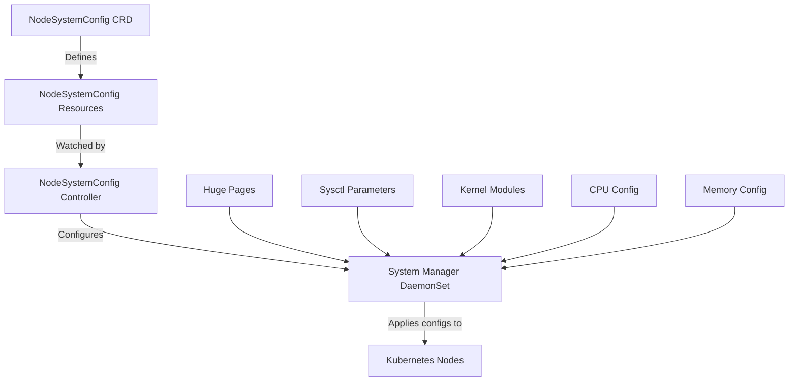

# NodeSystemConfig CRD

The NodeSystemConfig Custom Resource Definition (CRD) provides system-level node configuration capabilities for the AWS Multi-ENI Controller. It enables automatic configuration of huge pages, sysctl parameters, kernel modules, CPU optimizations, and memory optimizations on Kubernetes nodes.

## Overview

NodeSystemConfig runs as an independent controller within the same Docker image as the AWS Multi-ENI Controller. It watches for NodeSystemConfig resources and applies system-level configurations to nodes that match the specified selectors.

## Features

- **Huge Pages Configuration**: Automatic setup of 2MB and 1GB huge pages with NUMA awareness
- **Sysctl Parameters**: Kernel parameter tuning with predefined presets for common use cases
- **Kernel Modules**: Automatic loading/unloading of kernel modules with parameters
- **CPU Optimizations**: CPU isolation, frequency governor, and turbo boost configuration
- **Memory Optimizations**: Swappiness, transparent huge pages, and KSM configuration

## Architecture



## Configuration Examples

### Basic Huge Pages Configuration

```yaml
apiVersion: networking.k8s.aws/v1alpha1
kind: NodeSystemConfig
metadata:
  name: basic-hugepages
spec:
  nodeSelector:
    workload: high-performance
  hugePagesConfig:
    enabled: true
    pages:
      - size: "2Mi"
        count: 1024
    mountPath: "/dev/hugepages"
```

### DPDK-Optimized Configuration

```yaml
apiVersion: networking.k8s.aws/v1alpha1
kind: NodeSystemConfig
metadata:
  name: dpdk-optimized
spec:
  nodeSelector:
    dpdk: "enabled"
  hugePagesConfig:
    enabled: true
    pages:
      - size: "2Mi"
        count: 2048
        numaNode: 0
    numaAware: true
  sysctlConfig:
    enabled: true
    presets:
      - "dpdk-optimized"
  kernelModulesConfig:
    enabled: true
    load:
      - "vfio"
      - "vfio-pci"
```

### High-Performance Networking

```yaml
apiVersion: networking.k8s.aws/v1alpha1
kind: NodeSystemConfig
metadata:
  name: high-perf-networking
spec:
  nodeSelector:
    networking: high-performance
  sysctlConfig:
    enabled: true
    presets:
      - "high-performance-networking"
      - "low-latency"
  cpuConfig:
    enabled: true
    isolatedCPUs: "2-7"
    governor: "performance"
    turboBoost: true
```

## Configuration Reference

### HugePagesConfig

| Field | Type | Description |
|-------|------|-------------|
| `enabled` | bool | Whether huge pages should be configured |
| `pages` | []HugePageSpec | List of huge page configurations |
| `mountPath` | string | Mount path for huge pages (default: /dev/hugepages) |
| `numaAware` | bool | Enable NUMA-aware huge pages allocation |

### SysctlConfig

| Field | Type | Description |
|-------|------|-------------|
| `enabled` | bool | Whether sysctl parameters should be configured |
| `parameters` | map[string]string | Custom sysctl parameters |
| `presets` | []string | Predefined sysctl configurations |

#### Available Presets

- `high-performance-networking`: Optimizes network buffer sizes and TCP settings
- `low-latency`: Reduces latency for real-time applications
- `dpdk-optimized`: Configures parameters for DPDK applications

### KernelModulesConfig

| Field | Type | Description |
|-------|------|-------------|
| `enabled` | bool | Whether kernel modules should be managed |
| `load` | []string | Modules to load |
| `unload` | []string | Modules to unload |
| `parameters` | map[string]map[string]string | Module parameters |

### CPUConfig

| Field | Type | Description |
|-------|------|-------------|
| `enabled` | bool | Whether CPU optimizations should be applied |
| `isolatedCPUs` | string | CPU cores to isolate (e.g., "2-7,10-15") |
| `governor` | string | CPU frequency governor |
| `turboBoost` | bool | Enable/disable turbo boost |

### MemoryConfig

| Field | Type | Description |
|-------|------|-------------|
| `enabled` | bool | Whether memory optimizations should be applied |
| `swappiness` | int32 | Kernel swappiness value (0-100) |
| `transparentHugePages` | string | THP setting (always/madvise/never) |
| `ksm` | KSMConfig | Kernel Samepage Merging configuration |

## Status Monitoring

NodeSystemConfig provides detailed status information for each configured node:

```yaml
status:
  configurations:
    - nodeID: "i-1234567890abcdef0"
      nodeName: "ip-10-0-1-100.ec2.internal"
      hugePagesStatus:
        configured: true
        totalAllocated: 1024
        totalAvailable: 1024
        pages:
          - size: "2Mi"
            requested: 1024
            allocated: 1024
            available: 1024
      overallStatus: "Applied"
      lastUpdated: "2024-01-15T10:30:00Z"
```

## Integration with NodeENI

NodeSystemConfig works independently of NodeENI but can be used together for comprehensive node configuration:

1. **NodeENI**: Manages AWS ENI attachment and network interface configuration
2. **NodeSystemConfig**: Manages system-level optimizations for performance

Both controllers run in the same Docker image and can be deployed together or separately based on requirements.

## Best Practices

1. **Node Labeling**: Use descriptive node labels for precise targeting
2. **Resource Planning**: Ensure sufficient memory for huge pages allocation
3. **Testing**: Test configurations in development before production deployment
4. **Monitoring**: Monitor node resources and application performance
5. **Gradual Rollout**: Apply configurations to a subset of nodes first

## Troubleshooting

### Common Issues

1. **Insufficient Memory**: Ensure nodes have enough memory for huge pages
2. **Module Loading Failures**: Verify kernel modules are available
3. **Permission Issues**: Ensure proper RBAC permissions for the controller
4. **Node Compatibility**: Verify configurations are compatible with node OS

### Debugging

Check controller logs:
```bash
kubectl logs -n eni-controller-system deployment/aws-multi-eni-controller
```

Check NodeSystemConfig status:
```bash
kubectl get nodesystemconfig -o yaml
```

Check node system configuration:
```bash
kubectl describe node <node-name>
```
