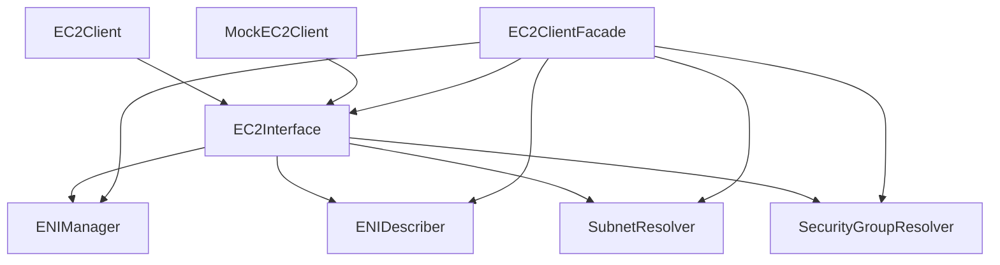

# AWS Package

This package provides utilities for interacting with AWS services, particularly EC2 for managing Elastic Network Interfaces (ENIs).

## Architecture

The package follows SOLID principles with a focus on:

1. **Single Responsibility Principle**: Each component has a single responsibility
2. **Interface Segregation**: Interfaces are focused on specific functionality
3. **Dependency Inversion**: High-level modules depend on abstractions

### Component Structure



## Interfaces

### EC2Interface

The main interface that combines all EC2 operations:

```go
type EC2Interface interface {
    ENIManager
    ENIDescriber
    SubnetResolver
    SecurityGroupResolver
}
```

### ENIManager

Responsible for ENI lifecycle management:

```go
type ENIManager interface {
    CreateENI(ctx context.Context, subnetID string, securityGroupIDs []string, description string, tags map[string]string) (string, error)
    AttachENI(ctx context.Context, eniID, instanceID string, deviceIndex int, deleteOnTermination bool) (string, error)
    DetachENI(ctx context.Context, attachmentID string, force bool) error
    DeleteENI(ctx context.Context, eniID string) error
}
```

### ENIDescriber

Responsible for describing ENIs:

```go
type ENIDescriber interface {
    DescribeENI(ctx context.Context, eniID string) (*EC2v2NetworkInterface, error)
    WaitForENIDetachment(ctx context.Context, eniID string, timeout time.Duration) error
}
```

### SubnetResolver

Responsible for subnet operations:

```go
type SubnetResolver interface {
    GetSubnetIDByName(ctx context.Context, subnetName string) (string, error)
    GetSubnetCIDRByID(ctx context.Context, subnetID string) (string, error)
}
```

### SecurityGroupResolver

Responsible for security group operations:

```go
type SecurityGroupResolver interface {
    GetSecurityGroupIDByName(ctx context.Context, securityGroupName string) (string, error)
}
```

## Implementations

### EC2Client

The original implementation of the EC2Interface.

### EC2ClientFacade

A new implementation that follows the facade pattern, delegating to specialized components:

- EC2ENIManager
- EC2ENIDescriber
- EC2SubnetResolver
- EC2SecurityGroupResolver

### MockEC2Client

A mock implementation for testing.

## Factory Functions

### CreateEC2Client

Creates a new EC2 client based on environment configuration:

```go
func CreateEC2Client(ctx context.Context, region string, logger logr.Logger) (EC2Interface, error)
```

- If `USE_EC2_FACADE=true` is set in the environment, returns an EC2ClientFacade
- Otherwise, returns the original EC2Client for backward compatibility

### CreateMockEC2Client

Creates a new mock EC2 client for testing:

```go
func CreateMockEC2Client() EC2Interface
```

## Retry Logic

The package includes a dedicated retry package for handling AWS API retries:

```go
import "github.com/johnlam90/aws-multi-eni-controller/pkg/aws/retry"
```

See the [retry package README](./retry/README.md) for more details.
